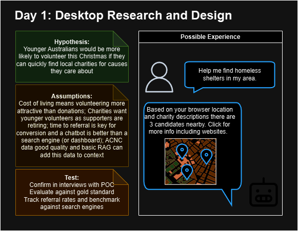
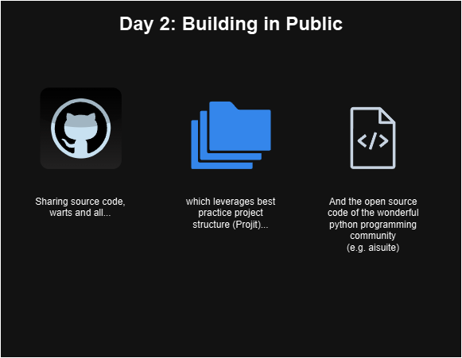
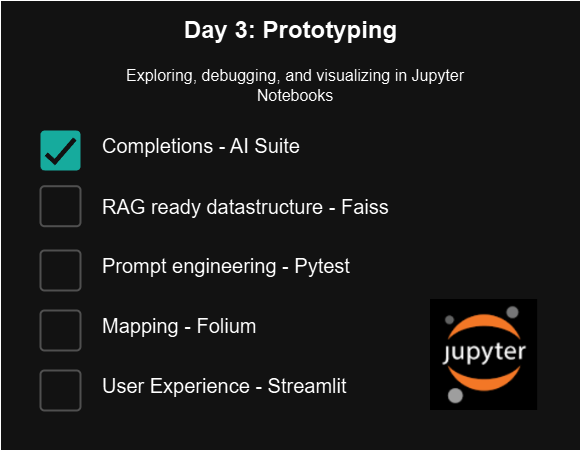
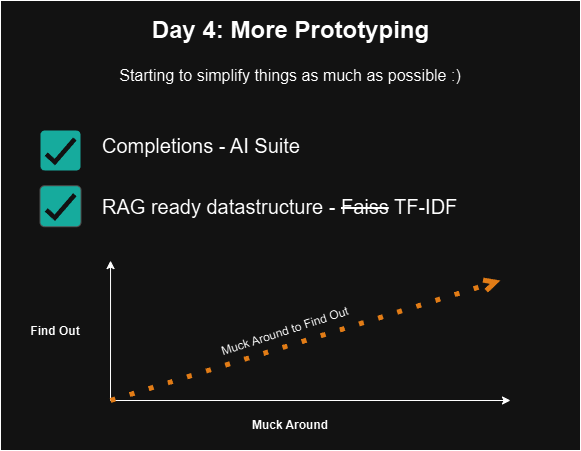
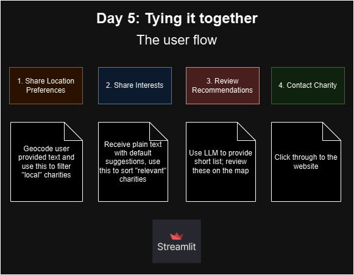
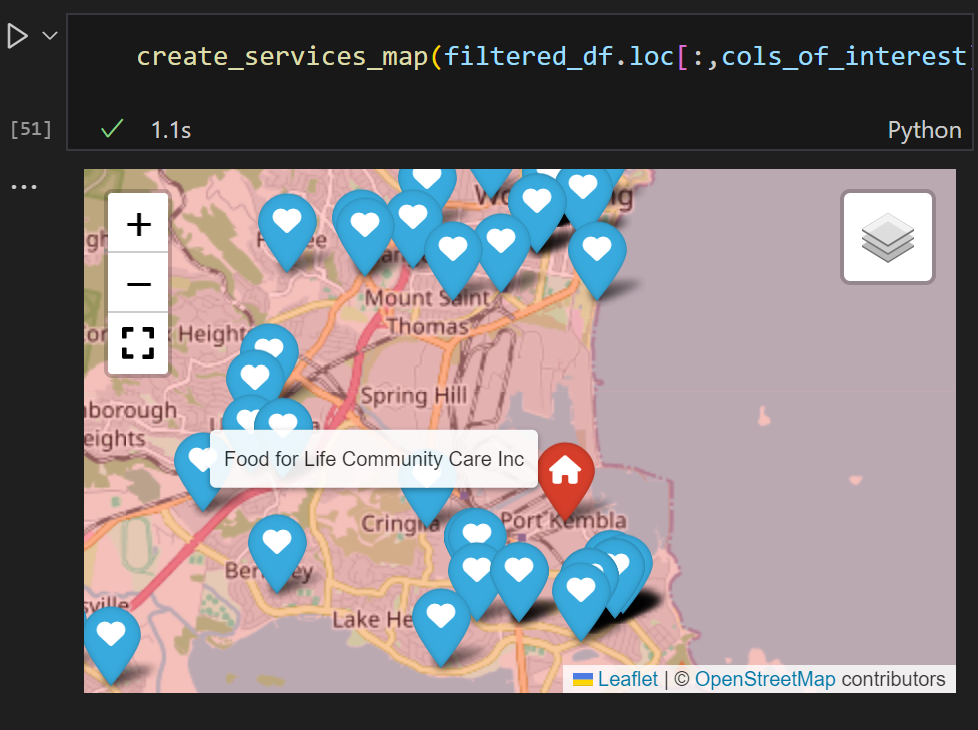

# Buildmas24🎄✨
A Christmas AI Coding Effort

## Project Scope
1. during the "12 days of Christmas",
2. bash together a basic AI product,
3. that helps aussies volunteer at local charities.

---

## Progress

### Day 1 - Research and Design
- Basic desktop research to define customer problem, assumptions, hypotheses. 
- starting to recruit prospective users.

---

### Day 2 - Building in public
- Establishing the github repo to build in public, 
- implementing best practice project structure - [projit](https://github.com/john-hawkins/projit),
- installing open source code modules e.g. [aisuite](https://github.com/andrewyng/aisuite),
- fetching [acnc dataset from data.gov.au](https://data.gov.au/dataset/ds-dga-b050b242-4487-4306-abf5-07ca073e5594/details?q=acnc)

---
### Day 3 - Prototyping
- using a jupyter notebook to prototype a number of things needed for the app - starting with LLM completions
- Pace of development is slower than expected - might be 6 days, not 12 days, at this rate! 🫠

---

### Day 4 - Prototyping continued
- Explored the 2022 Annual Information Statement program data, released May 2024 - a more granular dataset from the acnc - [link](https://data.gov.au/dataset/ds-dga-311c24f3-fc09-42e7-8362-f15a76334a75/details?q=AIS)
- Transformed the data using `data_prep.ipynb`
- Started to think through Retrieval Augmented Generation - and pivoted to a super simple method of creating "embeddings" (TF-IDF) and storing them (pickle files) to clear this hurdle quickly

---

### Day 5 - POC
- Finished prototyping TF-IDF
- Finished engineering initial prompt
- Started making some maps
- Pulling it together in streamlit to support the following user journey:

